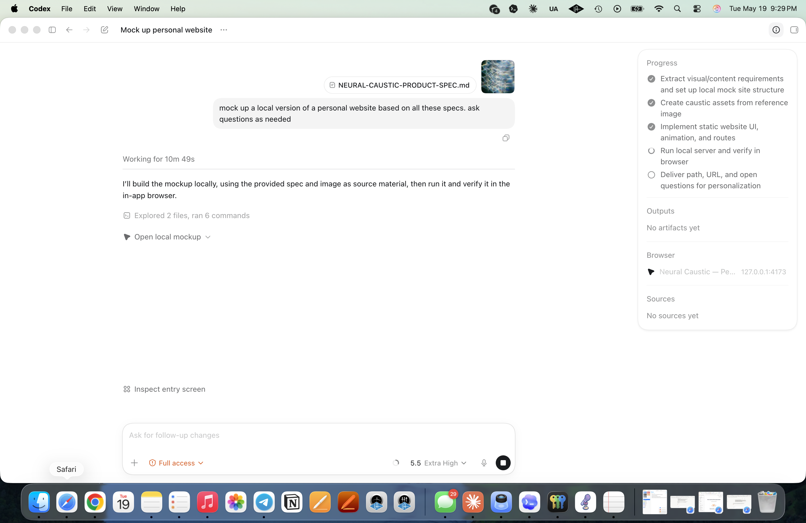
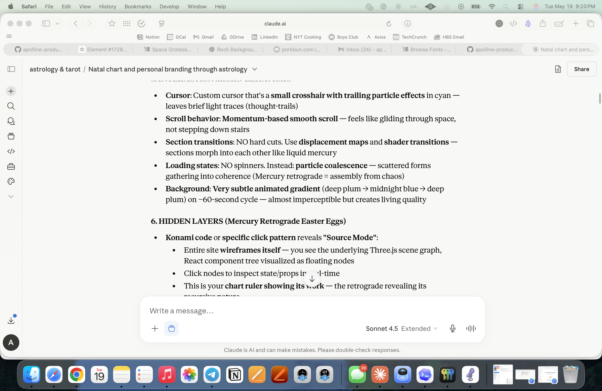
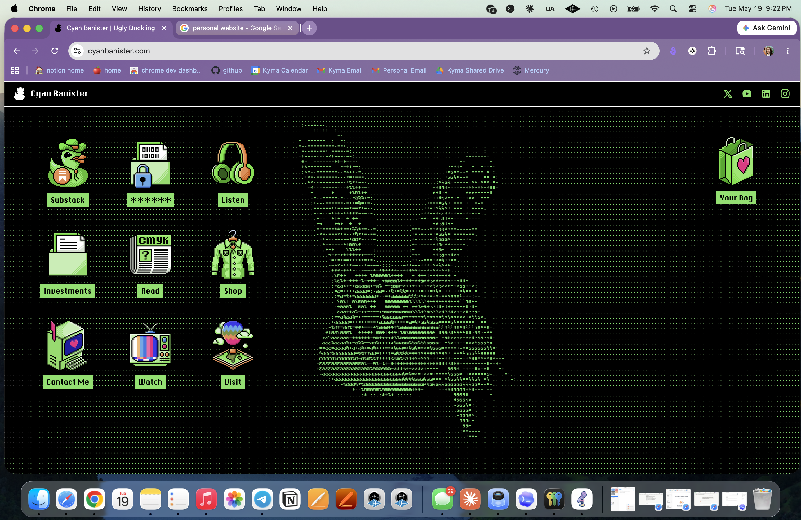
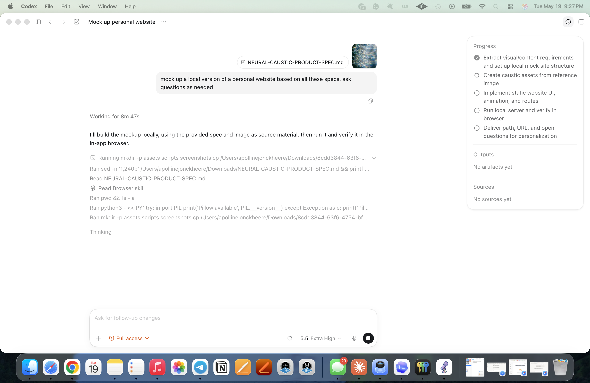
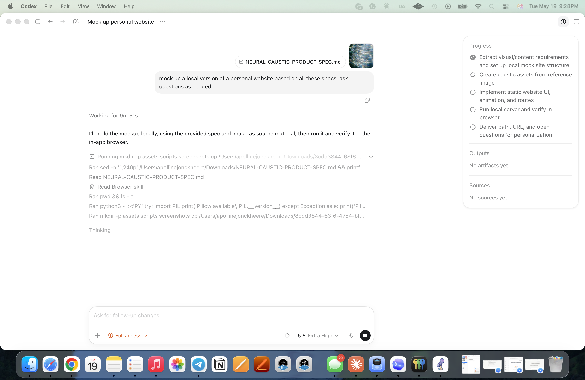
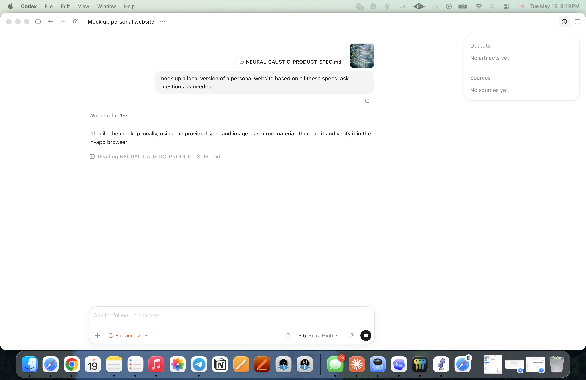

# timbre

> what did you say again?

A native macOS app for capturing, transcribing, and reasoning about voice memos. Transcription runs **fully on-device** with WhisperKit + on-device speaker diarization. Analysis (summary, decisions, action items, open questions) is **opt-in** and runs through either your own OpenAI key or any LLM you can paste into — the result is always stored as a flat `.md` file you own.


## why timbre

Most meeting tools force you to pick between **privacy** (local-only, but stuck in one app's database) and **intelligence** (cloud transcription + LLM analysis, but your raw audio leaves the device). Timbre keeps the audio + transcript local, lets you do the smart stuff with whichever LLM you trust, and writes every analysis as a portable markdown file:

```
~/Desktop/Code/apolline-production/timbre/data/analyses/
├── 2026-05-09_a16z-application-kickoff.md
├── 2026-05-11_design-crit-idan.md
├── 2026-05-14_y2k-research-session.md
└── 2026-05-18_investor-meeting-prep.md
```

The `.md` file is the canonical store. Edit it in Obsidian, grep it, let an agent walk it — timbre is just the UI layer.



## the four surfaces

### record

One mic button. Press to start, press to stop. Live waveform. The recording lands in your library as an `.m4a`.

### decode

Sidebar of your memos, transcript on the right. Click-to-seek, speaker rename, find/replace, edit mode, export to Markdown/SRT/JSON/plaintext, copy-to-clipboard, and the `✨ prompt` button that runs analysis.

### browse

The database view. Every recording is a card; filter by person, by time range, by free-text keyword. Click a card to open the **side panel** with the full analysis: title card on top, the actions banner (prompt + edit), and one card per analysis section.




Click `✏️ edit` and every card becomes inline-editable — summary and notes turn into TextEditors, each decision / action / question becomes a TextField row with delete and add controls. Click `✓ done` to save; the structured data updates and the .md file gets re-written.



### debrief

A cross-meeting aggregation: every **open question**, every **key decision**, every **action item** — across all your memos, in three columns. Each card tags its source meeting (`📄 chip` bottom-left) and offers a single action:

- `answer` (questions + decisions) → opens a text input → saved as a markdown `> blockquote` under the bullet in the `.md` file, marks resolved
- `complete` (actions) → marks done + dolphin celebration




Toggle the `resolved` filter to see the items you've worked through, with their resolutions inline:



## settings + developer

`me` button bottom-right of Home opens the settings sheet. AI provider (OpenAI key, stored in macOS Keychain), a **developer** section that seeds 5 demo memos covering every analysis state, and a **reset all data** that wipes everything for a clean install or screenshot pass.



## architecture

Each memo's analysis is mirrored to disk as a `.md` file with YAML frontmatter:

```markdown
---
timbre-memo-id: CEE97AC2-45EF-426D-B49E-F5B4F5F5FEB6
title: a16z application kickoff
date: 2026-05-09T23:15:00Z
duration: 4440
model: demo-seed
analyzed: 2026-05-20T04:19:18Z
---

## SUMMARY
kickoff for the a16z application. agreed on the gatekeeper framing as the headline thesis.
structured the application around three reference points: a profile interview, a video deep-
dive, and a written architecture brief.

## DECISIONS
- [x] target friday as the application submission deadline
  > shipped the kickoff memo internally before drafting.
- [x] defer polish on the video until the interview lands
  > deferred polish until after the first read-through.

## ACTIONS
- [x] both: review architecture brief outline thursday
- [x] apolline: draft the gatekeeper framing in 2-3 quotable paragraphs
```

GitHub-flavored task lists (`- [ ]` / `- [x]`) survive any markdown editor. Nested `  > blockquote` lines under a bullet hold the user's answer. The render/parse round-trip is symmetric (`AnalysisPromptBuilder.renderAnalysisMarkdown ↔ parseManualResponse`) so the .md file is genuinely the source of truth, not a sidecar export.

## requirements

- macOS 14.0 (Sonoma) or later
- Apple Silicon recommended (M1/M2/M3/M4) for fast transcription
- Xcode 16+ or Swift 5.9+ command line tools
- ~150 MB disk for the base WhisperKit model, ~3 GB for large-v3

## build

```bash
git clone https://github.com/apollinej/apolline-production.git
cd apolline-production/Timbre
./build.sh release
open Timbre.app
```

| Command | What it does |
|---------|-------------|
| `./build.sh` | Debug build, creates `Timbre.app` in the project dir |
| `./build.sh release` | Optimized release build |
| `./build.sh install` | Release build + copy to `/Applications` |
| `./build.sh clean` | Remove build artifacts |

Or open `Package.swift` in Xcode and hit ⌘R.

## supported audio formats

`.m4a` `.mp3` `.wav` `.flac` `.aac` `.caf` `.aiff` `.aifc` `.mp4`

## storage layout

```
<storage root>/
├── library/      # Imported audio files (uuid-named .m4a/.wav/...)
├── transcripts/  # Plain text transcript mirrors
├── analyses/     # YYYY-MM-DD_<slug>.md — the canonical analysis files
├── models/       # WhisperKit model cache
└── timbre.store  # SwiftData SQLite database
```

Default root is `~/Desktop/Code/apolline-production/timbre/data/`. Change it in settings.

## tech stack

- **Swift 5.9+** / **SwiftUI** — macOS-native, no Electron
- **SwiftData** — local persistence
- **[WhisperKit](https://github.com/argmaxinc/WhisperKit)** — CoreML Whisper on the Apple Neural Engine
- **[SpeakerKit](https://github.com/argmaxinc/WhisperKit)** — on-device pyannote speaker diarization
- **AVFoundation** — audio playback + waveform extraction
- **DotGothic16** (Google Fonts, SIL OFL) — the pixelated Y2K display font used throughout

Models are downloaded automatically on first use from HuggingFace. No token required — the community pyannote model (CC-BY-4.0) is used by default.

## try it without setup

In Settings → developer → **seed demo data**, click once. Timbre creates 5 example memos covering every UI state — un-analyzed, fresh analysis, partial resolutions, fully completed, and summary-only — so you can poke at Browse and Debrief end-to-end without recording anything. Click **reset all data** when you're done.

## contributing

Issues and pull requests welcome at [github.com/apollinej/apolline-production](https://github.com/apollinej/apolline-production). For bugs, include macOS version, the surface you were on (record / decode / browse / debrief), and steps to reproduce.

## license

MIT — see [LICENSE](LICENSE).
