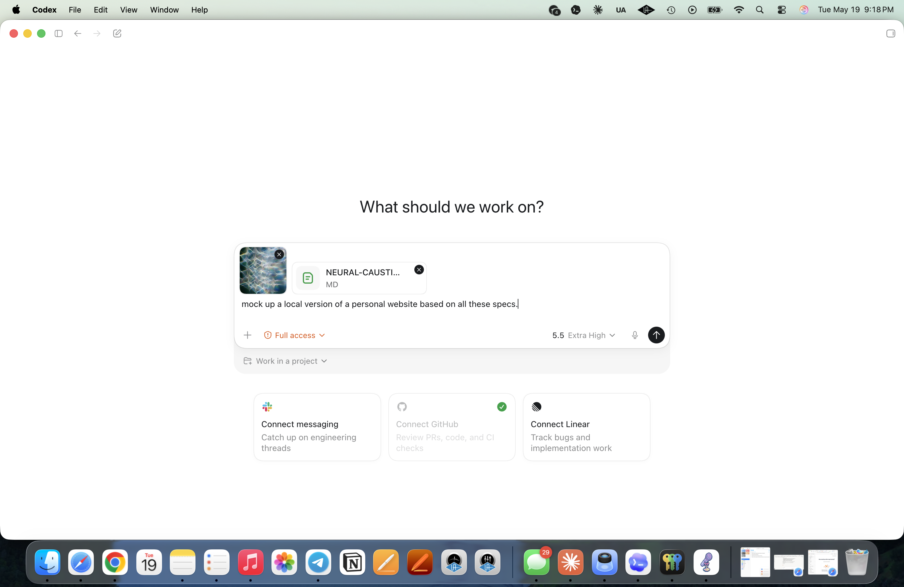
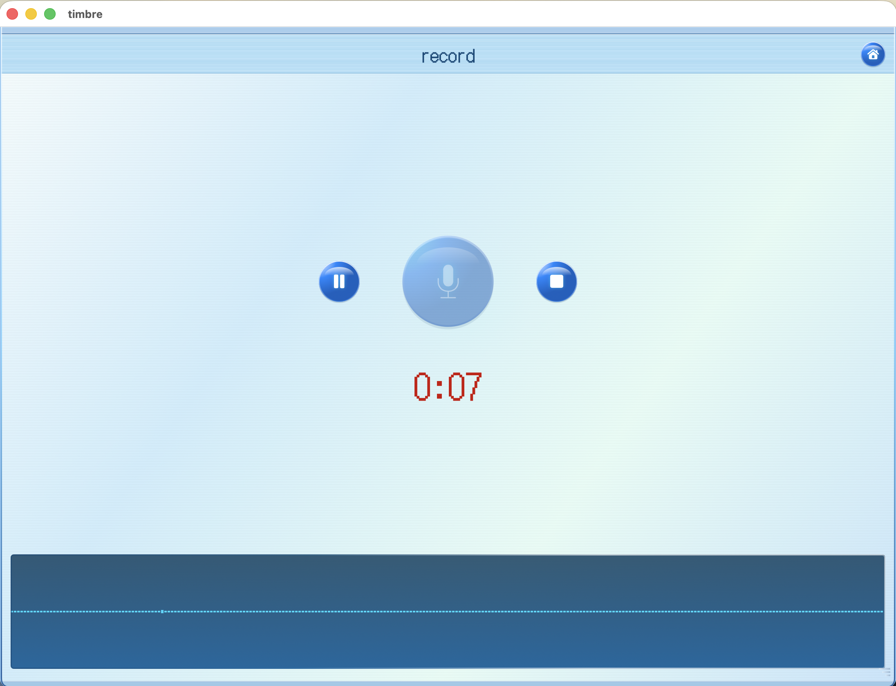
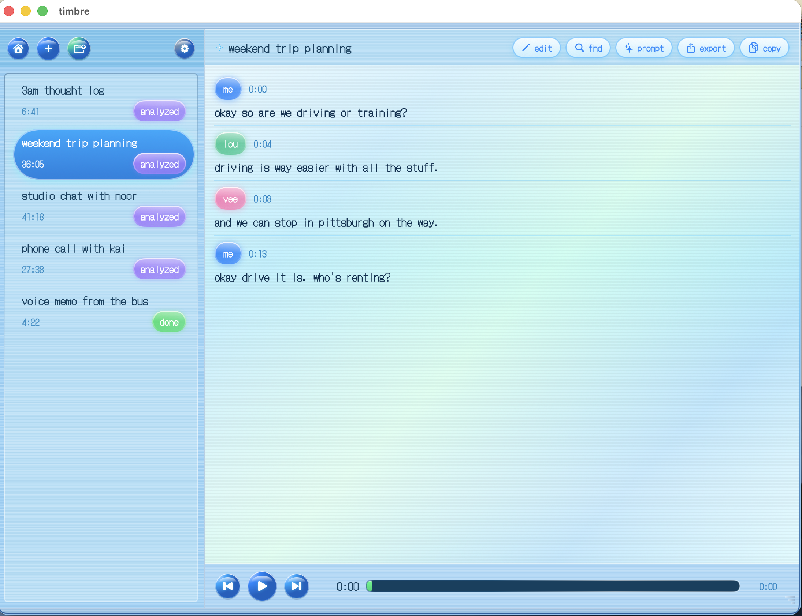
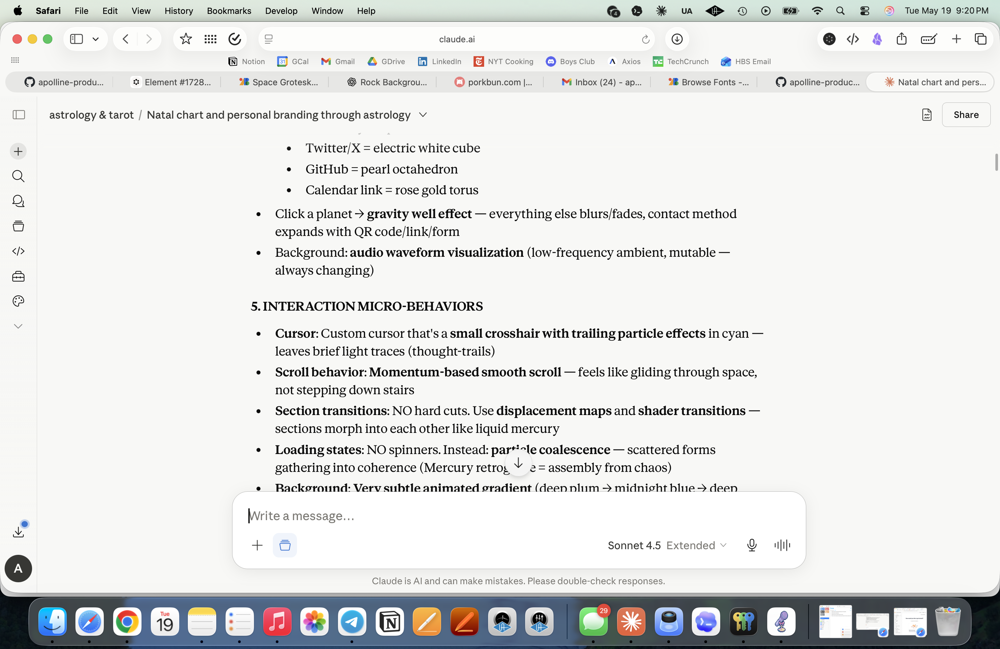

```
                                        (
                                   (   (
        )              )\  )\ (            (
     ( /(  `  )    (  ((_)((_))\   (      ))\
     )(_)) /(/(    )\  _   _ ((_)  )\ )  /((_)
    ((_)_ ((_)_\  ((_)| | | | (_) _(_/( (_))
    / _` || '_ \)/ _ \| | | | | || ' \))/ -_)
    \__,_|| .__/ \___/|_| |_| |_||_||_| \___|
          |_|
```

# timbre 🎙️

> what did you say again? mirror your insights, ramblings, rants.

[](LICENSE)
[](#install-macos-only)
[](#privacy)



·  ˚  ✦  .  ·  ˚  ✦  .  ·  ˚  ✦  .  ·  ˚  ✦  .  ·  ˚  ✦  .

### developer note

**the why:** wanted AI-native note-taking like Obsidian, but for voice instead of typing. i use OpenClaw agents every day and needed a front-end layer between thinking out loud and what i'm actually working on.

**the friction:** granola or otter cost $$$ and aren't native with my kai agent. no good way to capture voice memos and turn them into searchable, transposable rich info that can be visualized outside your agent.

**the motivation:** your everyday tools should spark delight. retro aesthetics, whimsical touches, DJ pad buttons you actually want to press. productivity doesn't have to look like enterprise SaaS.

**the name:** «timbre» means "tone" in french. the quality that makes a voice recognizable.

**the moment:** my second open-source project. first one with a lightweight on-device AI model. first one with agentic integration.

☕ [buy me a coffee](https://ko-fi.com/apollineproduction)

---

## what it does

**record** — capture your thoughts as you think them out loud


**decode** — pure assess mode. transcribe with Whisper locally, edit the output, prompt AI to surface insights you'd miss reading raw text


**browse** — your vocal history. filter by who you were talking about, when, what topics came up. see it as cards, list, or calendar


**debrief** — your analyzer. action items floating across all your memos, open threads you haven't closed, decisions you made that you'd otherwise forget


not a meeting recorder. your personal knowledge base that accepts voice instead of forcing you to type everything.

---

## install (macos only)

requires macos 14+ and apple silicon recommended. Whisper models are big — base is ~150mb, large-v3 is ~3gb.

```bash
git clone https://github.com/apollinej/apolline-production.git
cd apolline-production/Timbre
./build.sh release
open Timbre.app
```

or open `Package.swift` in Xcode and hit ⌘R.

first transcription downloads the Whisper model automatically from HuggingFace. takes a minute on a decent connection. no token required.

## how it works

hit record, talk while you think, stop when you're done. name it something you'll remember. tag who or what it was about.

click decode. [WhisperKit](https://github.com/argmaxinc/WhisperKit) transcribes on your machine — no cloud, no API calls. when it's done, you can edit mistakes and replace mispellings across all instances. then hit "prompt" to run AI analysis. this runs either your API integration or manual MD upload.

browse shows all your past memos. your library.

debrief catches progress and decision residue that you didn't. each time you answer an open question or make a decision or complete a task, not only will a cute dolphin swim across the window but your files get updated.

## under the hood

SwiftUI + SwiftData (local-first, optional CloudKit sync planned). WhisperKit for transcription. modular AI layer so you bring your own API key or run local models. exports to markdown so it plays nice with OpenClaw agents and Obsidian vaults.

corrections persist globally — type "Idam" once and it stops suggesting "Edom" everywhere.

### project structure

```
Timbre/
├── Package.swift              # SwiftPM manifest
├── VERSION                    # single source of truth for app version
├── build.sh                   # debug | release | install | clean
├── LICENSE                    # MIT
├── timbre icon.png            # source icon, processed at build time
├── screenshots/               # README screenshots
├── Sources/Timbre/
│   ├── TimbreApp.swift        # @main app entry point
│   ├── Models/                # SwiftData @Model types
│   │   ├── Memo.swift                #   recording + metadata
│   │   ├── Transcript.swift          #   whisperkit output
│   │   ├── Segment.swift             #   one transcript line
│   │   ├── Speaker.swift             #   per-recording speaker id
│   │   ├── Person.swift              #   cross-memo identity
│   │   ├── MemoAnalysis.swift        #   summary + notes
│   │   ├── AnalysisItem.swift        #   decisions / actions / questions
│   │   └── ...                       #   (Folder, MemoStatus, ReplacementRule, Workspace)
│   ├── Views/
│   │   ├── ContentView.swift         #   routing + sidebar layout
│   │   ├── Home/                     #   home grid + bubbles
│   │   ├── Record/                   #   record screen + save popup
│   │   ├── Scan/                     #   browse cards + side panel + filters
│   │   ├── Threads/                  #   debrief columns + answer sheet
│   │   ├── Transcript/               #   transcript edit / playback
│   │   └── Settings/                 #   me sheet (api key, demo seed, reset)
│   ├── ViewModels/                   # @Observable state per surface
│   ├── Services/
│   │   ├── AudioRecorder.swift       #   AVAudioEngine wrapper
│   │   ├── AudioImporter.swift       #   drag/drop + file picker
│   │   ├── TranscriptionEngine.swift #   whisperkit + speakerkit
│   │   ├── AnalysisDiskExport.swift  #   .md write/sync
│   │   ├── ExportService.swift       #   markdown / SRT / JSON / txt
│   │   ├── ModelManager.swift        #   whisperkit model picker
│   │   └── Analysis/
│   │       ├── AnalysisProvider.swift     # protocol for LLM backends
│   │       ├── OpenAIProvider.swift       # default impl (gpt-4o)
│   │       ├── LocalAnalysisProvider.swift# stub for future local LLM
│   │       ├── AnalysisOrchestrator.swift # routes through the provider
│   │       ├── AnalysisPrompts.swift       # render + parse markdown
│   │       └── KeychainService.swift       # OpenAI key storage
│   ├── Utilities/                    # paths, theme, fonts, migrations
│   └── Resources/                    # DotGothic16-Regular.ttf, PrivacyInfo.xcprivacy
└── Tests/TimbreTests/         # XCTest target
```

### privacy

- your api key, voice recordings, and `.md` files are stored locally in the directory of your choosing (default `~/Desktop/Code/apolline-production/timbre/data/`). nothing is transmitted anywhere unless you explicitly click `prompt` after saving an OpenAI key.
- the OpenAI key lives in macOS Keychain — never in plain-text config files, never in the `.md` exports, never logged.
- when `prompt` runs with a key set, the only outbound request is to `https://api.openai.com/v1/chat/completions` carrying your transcript + meeting metadata. no other endpoint. no telemetry, no analytics, no crash reporting.
- if you don't set a key, no outbound network calls happen at all — `prompt` just copies the analysis prompt to your clipboard so you can run it in any LLM and paste the result back.
- you can clear everything via Settings → developer → **reset all data**.

---

## aesthetic

y2k desktop-core. brushed metal, soft shadows, buttons that feel like you're pressing a DJ pad. pixelated dolphins. sparkles when you save something.

- **fonts:** DotGothic16 (display) & SF / SF Mono (system fallback)
- **palette:** silver / chrome / cyan blue, with green accents for resolved state
- **style:** retro 2000s macOS, pixel art details

## contributing

contributions welcome! just sharing in case it adds joy for someone else, so:

1. fork it
2. create your branch (`git checkout -b feat/cool-thing`)
3. make your changes
4. build and test locally (`./build.sh release`, then `open Timbre.app`)
5. open a pr

## license

[MIT](LICENSE)

<div align="center">

```
˚ . ✦ · ;] · ✦ . ˚
```

made with 💿 by [apolline](https://ko-fi.com/apollineproduction)

*every routine tool needs a little whimsy*

</div>
